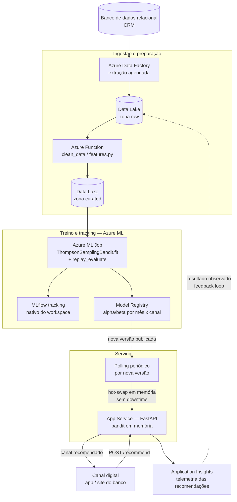

# Datathon FIAP — Fase 05 (Machine Learning Engineering)

Plataforma de experimentação adaptativa para decidir, por cliente, **qual canal de contato usar numa campanha de telemarketing bancário** (`cellular` ou `telephone`), usando um **multi-armed bandit contextual (Thompson Sampling)** em vez de uma regra fixa.

O cenário é o de uma instituição financeira digital fictícia que precisa decidir, em diferentes canais, qual oferta/próximo passo apresentar a cada cliente elegível — sem depender de regras fixas ou testes A/B longos, que demoram a reagir a mudanças de contexto.

## Índice

- [Base de dados](#base-de-dados)
- [Abordagem](#abordagem)
- [Estrutura do repositório](#estrutura-do-repositório)
- [Instalação](#instalação)
- [Como executar](#como-executar)
- [Resultados](#resultados)
- [Arquitetura-alvo em nuvem (Azure)](#arquitetura-alvo-em-nuvem-azure)
- [Ciclo de vida MLOps](#ciclo-de-vida-mlops)
- [Limitações conhecidas](#limitações-conhecidas)
- [Status do projeto](#status-do-projeto)

## Base de dados

[Bank Marketing Data Set (Yamahata) — Kaggle](https://www.kaggle.com/datasets/henriqueyamahata/bank-marketing)

Campanhas de telemarketing de um banco português (41.188 clientes, 2008–2010), com o objetivo original de prever se o cliente assina um depósito a prazo (`y`). Reaproveitamos essa base como log histórico de decisões de canal: cada linha já registra **qual canal foi usado** (`contact`) e **se o cliente converteu** (`y`), o que é exatamente o que um bandit precisa para aprender.

Colunas de vazamento temporal (`duration`, só conhecida depois da ligação) são descartadas — decisão documentada na EDA e exigida pelo próprio enunciado do desafio.

## Abordagem

- **Braço (ação controlável)**: `contact` — `cellular` ou `telephone`.
- **Contexto**: atributos do cliente + indicadores macroeconômicos do período. O bandit usa `month` como segmento de decisão, por ser o sinal com crossover real entre os braços (em `abr`/`ago`/`nov`, `telephone` converte melhor; no resto do ano, `cellular` domina).
- **Baseline**: regra fixa — sempre o braço com melhor conversão histórica agregada.
- **Bandit adaptativo**: Thompson Sampling Beta-Bernoulli, com um par (alpha, beta) por (mês, canal).
- **Avaliação**: replay/rejection sampling (Li et al.) sobre os dados logados, já que a base é histórica e estática, não um ambiente interativo.
- **Paradigma de aprendizado**: aprendizado por reforço — mais especificamente um *bandit contextual*, treinado em modo **offline/batch** a partir de dados logados (não há interação ao vivo com clientes durante o desenvolvimento).

## Estrutura do repositório

```
notebooks/
  00_eda.ipynb                # Etapa 1 — EDA e decisões de tratamento
  01_feature_engineering.ipynb# Etapa 2 — preparação da base (contexto/braço/alvo)
  02_baseline_bandit.ipynb    # Etapa 3 — baseline vs. Thompson Sampling (replay)
  03_golden_set.ipynb         # Etapa 4 — golden set de 5 clientes explicado
src/tech_challenge_5/
  features.py                 # limpeza de dados + encoder de contexto
  bandit.py                   # BaselinePolicy, ThompsonSamplingBandit, replay_evaluate
  api.py                      # Etapa 5 — serviço FastAPI de recomendação
data/
  raw/                        # CSV baixado do Kaggle (não versionado)
  processed/                  # base tratada + encoder (gerados localmente)
mlflow.db                     # Etapa 7 — tracking store (SQLite, gerado localmente, não versionado)
mlruns/                       # Etapa 7 — artifacts das runs (gerado localmente, não versionado)
examples/
  recommend_request.json      # payload de exemplo para POST /recommend (demo/vídeo pitch)
```

## Instalação

Requer [uv](https://docs.astral.sh/uv/) e Python 3.14 (`.python-version` do repositório).

```bash
git clone <url-deste-repositório>
cd tech_challenge_5
uv sync
```

Baixe o CSV `bank-additional-full.csv` do [Kaggle](https://www.kaggle.com/datasets/henriqueyamahata/bank-marketing) e coloque em `data/raw/bank-additional-full.csv` (a pasta já existe, o arquivo não é versionado no git).

## Como executar

**1. Gerar a base tratada** (Etapa 2 — cria `data/processed/bank_marketing_prepared.csv` e o encoder):

```bash
uv run python -m tech_challenge_5.features
```

**2. Rodar os notebooks**, na ordem, para reproduzir EDA → preparação → baseline/bandit → golden set:

```bash
uv run python -m jupyterlab
```

> Se `uv run jupyter lab` (ou qualquer outro comando que chame diretamente um `.exe` da `.venv/Scripts/`, como `uv run mlflow` ou `uv run uvicorn`) der erro de **Application Control Policy** bloqueando o executável, troque pela forma `uv run python -m <módulo>` — todos os comandos abaixo já estão nesse formato por causa disso.

Abra e execute `00_eda.ipynb` → `01_feature_engineering.ipynb` → `02_baseline_bandit.ipynb` → `03_golden_set.ipynb`.

A execução de `02_baseline_bandit.ipynb` também registra os parâmetros/métricas do baseline e do Thompson Sampling no MLflow (Etapa 7, seção 10 do notebook), local, sem servidor.

**3. Usar o tracking do MLflow** (Etapa 7 — depois de rodar `02_baseline_bandit.ipynb` ao menos uma vez):

```bash
uv run python -m mlflow ui --backend-store-uri sqlite:///mlflow.db
```

Acesse `http://127.0.0.1:5000`. O que dá pra explorar lá:

- **Lista de runs**: o experimento `datathon-canal-contato` (menu à esquerda) mostra as runs `baseline` e `thompson_sampling` numa tabela — dá pra adicionar colunas de métrica (`conversao_final`, `conversao_media`, `win_rate`, `lift`, `oracle_reward`) clicando no seletor de colunas.
- **Comparar runs**: marque o checkbox das duas runs e use a opção de comparação — mostra parâmetros e métricas lado a lado (útil para o vídeo: baseline sem parâmetro nenhum de aprendizado vs. Thompson Sampling com `segment_col`, `prior_alpha`, `prior_beta`, `n_seeds`).
- **Abrir a run `thompson_sampling`**: parâmetros e métricas finais ficam na visão geral da run; a métrica `conversao_final_por_seed` foi logada por `step` (0 a 29) — abrindo o gráfico dela dá pra ver a distribuição das 30 execuções que sustentam a conclusão "TS supera o baseline na maioria das rodadas".
- **Aba de artifacts**: os dois gráficos gerados no notebook (`conversao_acumulada.png`, `baseline_vs_thompson_sampling.png`) ficam renderizados ali, junto com `tabelas/comparison.json` e `tabelas/oracle_table.json` (tabela posterior aprendida vs. conversão histórica, navegável na própria UI).
- **Reprodutibilidade**: cada vez que `02_baseline_bandit.ipynb` é executado de novo, duas runs novas são criadas (nada é sobrescrito) — a UI acumula o histórico de execuções, do mesmo jeito que aconteceria com retreinos periódicos em produção.

**4. Subir a API** (Etapa 5 — serviço demonstrável):

```bash
uv run python -m uvicorn tech_challenge_5.api:app --reload
```

Acesse `http://127.0.0.1:8000/docs` (Swagger, gerado automaticamente) para testar `POST /recommend` direto do navegador, com validação e exemplos preenchidos para cada campo. Exemplo via `curl`:

```bash
curl -X POST http://127.0.0.1:8000/recommend \
  -H "Content-Type: application/json" \
  -d '{
    "age": 35, "campaign": 1, "previous": 1,
    "emp_var_rate": -1.8, "cons_price_idx": 92.893, "cons_conf_idx": -46.2,
    "euribor3m": 1.313, "nr_employed": 5099.1,
    "job": "student", "marital": "single", "education": "high.school",
    "default": "no", "housing": "no", "loan": "no",
    "month": "nov", "poutcome": "success", "nunca_contatado": false
  }'
```

Resposta:

```json
{"recommended_offer":"telephone","estimated_conversion":{"cellular":0.0998,"telephone":0.1194},"best_historical_offer":"telephone"}
```

Também há um payload pronto em `examples/recommend_request.json` (cliente em `ago`, outro mês de crossover), útil para demo/vídeo:

```bash
curl -X POST http://127.0.0.1:8000/recommend \
  -H "Content-Type: application/json" \
  -d @examples/recommend_request.json
```

Resposta:

```json
{"recommended_offer":"telephone","estimated_conversion":{"cellular":0.1049,"telephone":0.1365},"best_historical_offer":"telephone"}
```

## Resultados

Avaliação via replay, 30 execuções (seeds) diferentes (`notebooks/02_baseline_bandit.ipynb`):

| Política | Conversão | Observação |
|---|---|---|
| Baseline (sempre `cellular`) | 14,74% | regra fixa, não aprende |
| Thompson Sampling (contexto: mês) | 15,36% ± 0,52% | supera o baseline em 83% das 30 execuções, lift médio de **+4,2%** |
| Oráculo (melhor braço por mês, teto teórico) | 18,04% | referência inatingível — exige conhecer o melhor braço sem aprender |

(A amostragem da Beta no Thompson Sampling não é fixada por seed — os números variam levemente a cada execução do notebook; a ordem de grandeza e a conclusão, TS supera o baseline na maioria das execuções, se mantêm.)

**Golden Set** (`notebooks/03_golden_set.ipynb`) — 5 clientes reais, cobrindo os meses de crossover (`abr`, `ago`, `nov`) e os meses do padrão dominante (`mai`, `jul`): em todos os 5 casos, a recomendação do bandit final concordou com o melhor canal histórico real daquele mês.

Esses parâmetros e métricas (baseline e Thompson Sampling) também ficam registrados no MLflow (Etapa 7) — ver [Ciclo de vida MLOps](#ciclo-de-vida-mlops).

## Arquitetura-alvo em nuvem (Azure)

O projeto seria colocado no ar inteiramente na Azure, separando três responsabilidades: ingestão/preparação de dados, treino e rastreamento do modelo, e serviço de recomendação.

**Ingestão e preparação**: o Azure Data Factory extrai periodicamente os dados do CRM/banco relacional da empresa para a zona *raw* de um Data Lake; a chegada de um novo arquivo dispara uma Azure Function que aplica a limpeza (`features.clean_data`) e grava o resultado na zona *curated* — o equivalente ao nosso `bank_marketing_prepared.csv`.

**Treino e tracking**: um Job do Azure ML lê a zona *curated*, ajusta o bandit (`ThompsonSamplingBandit.fit`) e roda a avaliação comparativa (`replay_evaluate`, baseline vs. Thompson Sampling), registrando parâmetros e métricas no **MLflow nativo do workspace do Azure ML** (resolve a necessidade de tracking sem precisar hospedar um servidor MLflow à parte) e publicando o resultado — a tabela de alpha/beta por mês×canal — como um **Model versionado no Model Registry**.

**Serving e atualização sem downtime**: a API (FastAPI num App Service tradicional) mantém o bandit carregado em memória e faz *polling* periódico por uma nova versão publicada no Model Registry. Como o artefato é minúsculo (uma tabela de contadores, não uma rede neural), a atualização é um **hot-swap em memória** — baixa a nova versão, valida rapidamente e troca a referência do objeto em uso, sem reiniciar o processo nem derrubar conexões. Deployment slots (blue-green, nativos do App Service) ficam reservados para mudanças de *código* da aplicação, que são bem menos frequentes que retreinos do bandit. Application Insights captura cada recomendação servida, e esse log realimenta a zona *raw* do Data Lake, fechando o loop para o próximo ciclo de treino.



## Ciclo de vida MLOps

Localmente (Etapa 7), `02_baseline_bandit.ipynb` registra no MLflow — tracking store SQLite (`mlflow.db`), artifacts em `mlruns/`, ambos locais e não versionados — uma run `baseline` (braço fixo, conversão final) e uma run `thompson_sampling` (segmento de contexto, priors, conversão média/desvio/win-rate/lift sobre 30 seeds, oráculo, os dois gráficos comparativos e as tabelas posterior-vs-histórico como artifacts). Ver `uv run python -m mlflow ui --backend-store-uri sqlite:///mlflow.db` em [Como executar](#como-executar).

No desenho em nuvem acima, esse mesmo registro passa a ser feito pelo MLflow nativo do workspace do Azure ML, que também versiona o modelo publicado (Model Registry) — a mesma responsabilidade, sem precisar hospedar um servidor MLflow à parte.

## Limitações conhecidas

- O bandit segmenta a decisão apenas por `month` — dois clientes do mesmo mês sempre recebem a mesma recomendação, mesmo com perfis diferentes. Ampliar o contexto (ex.: combinar `month` com `poutcome`, ou um bandit contextual linear) é uma extensão natural.
- A avaliação por replay assume que a atribuição histórica do canal não dependia fortemente do contexto observado — uma simplificação necessária, já que a base é um log histórico e não um ambiente interativo.
- O resultado de um cliente individual do golden set é anedótico (n=1); a evidência estatística de que o bandit supera o baseline vem do replay com 30 seeds (Etapa 3), não de casos isolados.

## Status do projeto

- [x] Etapa 0 — Repositório, README e `pyproject.toml`
- [x] Etapa 1 — EDA (`00_eda.ipynb`) com base Kaggle referenciada
- [x] Etapa 2 — Preparação da base (`features.py`, `01_feature_engineering.ipynb`)
- [x] Etapa 3 — Baseline e Thompson Sampling comparados (`bandit.py`, `02_baseline_bandit.ipynb`)
- [x] Etapa 4 — Golden Set de 5 clientes (`03_golden_set.ipynb`)
- [x] Etapa 5 — Serviço demonstrável (`api.py`, FastAPI)
- [x] Etapa 6 — Arquitetura-alvo em nuvem (esta seção)
- [x] Etapa 7 — Tracking via MLflow (`mlflow.db` + `mlruns/`, seção 10 de `02_baseline_bandit.ipynb`)
- [x] Etapa 8 — Vídeo pitch (pendente)
